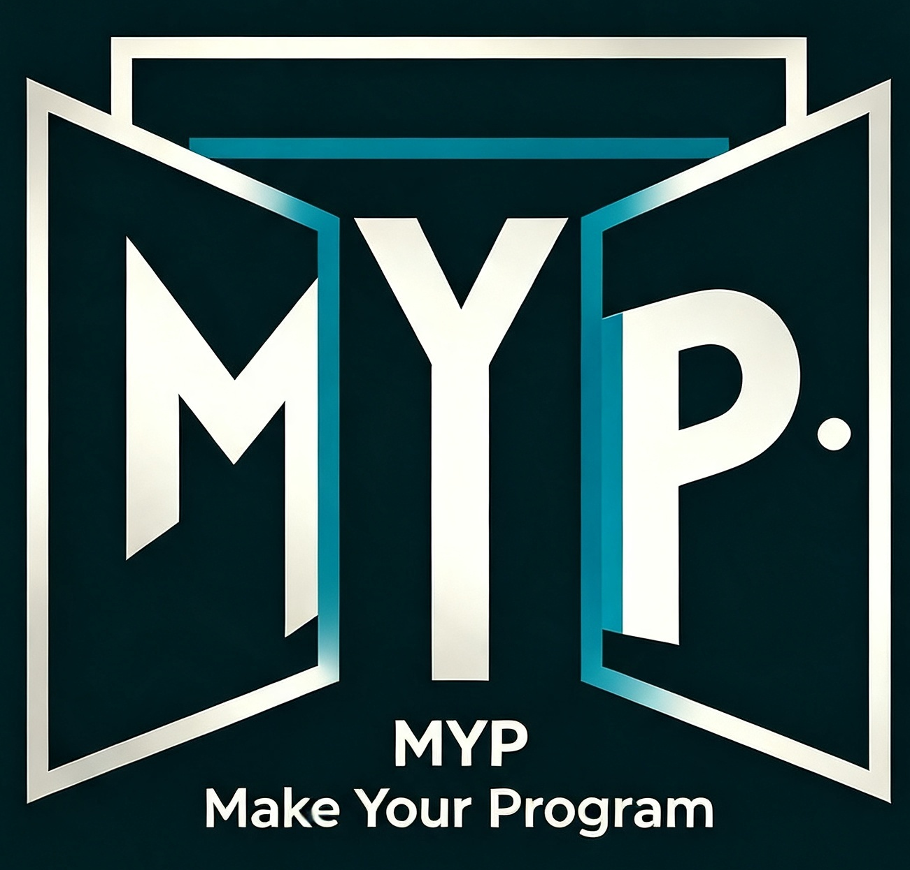

# MYP Programming Language

> Event-Driven Component Language | LLVM 21 Backend | Built-in GPU Support
>
> Compiler v3.15.197 | Language Spec v1.0

<p align="center">
  
</p>

**🌐 [中文](README.md)**

MYP is an **event-driven component** programming language built around `class` + `action:` / `event:` as architectural units, assembled declaratively via `mapping()`. The compiler is based on LLVM 21 and produces native executables.

## ✨ Key Features

| Feature | Description |
|---------|-------------|
| **Event-Driven Components** | Components communicate only via events, assembled with `mapping()` |
| **Actor-Style Concurrency** | `@thread` instances are naturally isolated, no locking needed |
| **Data Parallelism** | `@parallel for` auto-parallelization with a work-stealing thread pool |
| **Generics** | `ArrayList<T>`, `HashMap<K,V>`, `Queue<T>` and more |
| **Interface Polymorphism** | `interface` + vtable dispatch (fat pointers) |
| **Coroutines + Async I/O** | `@coro`/`await` register-level fibers (asm switching, no syscall) + `@async` unified async abstraction (timers/sockets/file executor) + `Coro.waitAnyOf` mixed waits |
| **Error Handling** | `Result<T,E>` / `Option<T>`/`T?` containers + layered `catch (Error)` exceptions |
| **Automatic Memory Mgmt** | ARC for class instances (automatic reference counting, additive, no new syntax) |
| **Derived Serialization** | `@derive(Json)` class annotation auto-generates toJson/fromJson (serde-style, zero runtime reflection) |
| **Operator System** | `operator:`/`@op("+")` overloading + `|>` operator pipe |
| **GPU Support** | CUDA backend, activated with `MYP_GPU=1` |
| **Zero-Dependency Stdlib** | 42 modules, pure MYP implementations |
| **LSP Integration** | Completion, hover, go-to-definition, document symbols |

## 🚀 Quick Start

### Build & Install

```bash
# Dependencies: LLVM 21 (incl. llc/opt/ld.lld backend tools), CMake 3.20+, GCC/lld
mkdir build && cd build
cmake .. -DCMAKE_PREFIX_PATH=/usr/lib/llvm-21/lib/cmake/llvm   # optional -DMYP_ENABLE_GPU=OFF to skip GPU
make -j$(nproc)                                                # or cmake --build . -j$(nproc)
```

The build runs two chains and produces `build/mypc` (the user-level compiler):

- **C++ oracle chain**: `mypc-seed` (LLVM 21 reference implementation; frontend
  oracle contract via `--frontend-dump`).
- **Self-hosted chain**: `mypc-seed` compiles `tools/selfhost/*.myp` → `myp_self`
  (stage-0) → self-compiles → `myp_self2` (stage-1) → re-compiles → `myp_self3`
  (stage-2); `scripts/bootstrap_install.sh` **MD5 gate** checks `myp_self2 == myp_self3`
  (byte-identical ⇒ self-hosting holds) → installs `myp_self2` as `build/mypc`.
- **Runtime archive**: `runtime_myp/*.myp` compiled by `myp_self` into
  `libmyp_rt_myp.a` (MYP runtime, de-gcc migration); generated programs link
  **MYP runtime only** by default (`(MYP runtime only)` marker).

Key artifacts (`build/`): `mypc` (self-hosted compiler), `mypc-seed` (oracle),
`myp_self/self2/self3`, `myp` (package manager), `myp_fmt2`/`myp_viz2` (self-hosted
formatter/visualizer), `myp_lsp`/`myp_debug`, plus `libmyp_rt_myp.a` (MYP runtime
archive) / `libmyp_rt.a` (C runtime).

Verify:

```bash
MYPCC=./build/mypc bash tests/run_tests.sh    # full regression (regression/negative/test-framework/self-host/GPU)
```

### Hello World

In MYP's event-driven model, output logic lives in a component's `action:` (and `main`
only does wiring) — the simplest form is `@startup` + `mypc run` (no hand-written `main`):

```myp
// hello.myp
import env;

class Hello {
    action:
        @startup void go() {
            Console.writeLine("Hello, MYP!");
        }
}
```

```bash
./build/mypc run hello.myp
# Output: Hello, MYP!
```

## 📚 Language Overview

### Components & Mapping

```myp
class Sensor {
    action:
        void read() { valueRead(25.5); }
    event:
        valueRead(double temp);
}

class Display {
    action:
        void show(double v) {
            Console.writeLine("Temperature: " + v);
        }
}

int main() {
    Sensor sensor = new Sensor();
    Display display = new Display();

    mapping() {
        Sensor.valueRead -> Display.show;  // declarative wiring (nodes use class names)
    }
    return 0;
}
```

### Parallel Computing

```myp
import atomic;

double[1000] tally;
@parallel for (int i = 0; i < 1000; i = i + 1) {
    Atomic.addDouble(tally, i, i * 1.5);  // thread-safe accumulation
}
```

### Coroutines & Async I/O

```myp
import env;
import coro;
import async;
import time;

class Worker {
    action:
        @coro long run() {
            Console.writeString("W:start\n");
            await Async.sleep(100);       // async sleep: suspend this coroutine, don't block the thread
            Console.writeString("W:woke\n");
            return 0;
        }
}

class Main {
    action:
        @startup void run() {
            Worker w = new Worker();
            long h = w.run();             // create + first-run the coroutine, returns its handle
            for (int i = 0; i < 10; i++) {
                Coro.scheduler();         // auto-schedule: advance all ready coroutines
                Time.sleep(20);
            }
        }
}

int main() { Main m = new Main() @thread; return 0; }
```

### Full Syntax

See the [Programming Manual](docs/manual_en.md) and [Design Document](docs/design.md) for full details.

## 📦 Standard Library (42 Modules)

| Category | Modules |
|----------|---------|
| **Basic I/O** | `env` (console), `io` (files), `text` (strings), `regex`, `base64` |
| **Data Structures** | `collections`: `ArrayList`, `HashMap`, `Set`, `Queue`, `Stack`, `Deque`, `PriorityQueue`, `LinkedList`, `Sort`, `StrHashMap`; `option` (`Option<T>`/`T?` nullable), `setops` (set operations) |
| **Mathematics** | `math` (trig/hyperbolic/inverse/constants), `random` (uniform/normal/exponential/poisson distributions) |
| **Time & Date** | `time`, `timeline`, `date` |
| **File System** | `fs` (paths/directory traversal) |
| **Networking** | `net` (TCP client/server), `http` (HTTP client) |
| **Process** | `process` (command execution/output capture) |
| **CLI** | `args` (argument parsing), `env` (environment variables) |
| **Memory** | `memory` (malloc/free/realloc raw memory + Memory class + `liveObjectCount` diagnostics) |
| **Concurrency** | `atomic`, `barrier`, `future`, `pool`, `sync` (Mutex/RWLock/CondVar/Semaphore), `coro` (coroutine scheduler), `async` (unified async I/O: timers/sockets/files), `channel` |
| **Error Handling** | `result` (`Result<T,E>` two-state container), `error` (layered exception types) |
| **Utilities** | `fmt` (printf-style formatting), `crypto` (CRC32/MD5/SHA), `logger`, `json`, `test`, `stream`, `rtti` (runtime type info) |
| **Graphics / GPU** | `sdl` (SDL2), `ui` (terminal TUI), `cuda` (CUDA GPU programming) |

## 🛠️ Toolchain

| Tool | Purpose |
|------|---------|
| `mypc` | Compiler (compile/link/format/`run` go-style direct execution) |
| `myp` | Package manager (init/build/install/run) |
| `myp_viz` | Visualization (DOT graph generation) |
| `myp_lsp` | Language server (LSP) |
| `myp_fmt` | Code formatter |
| `myp_fmt2` / `myp_viz2` | Self-hosted formatter / visualizer (in MYP, byte-identical to C++ versions) |
| `myp_debug` | Debug adapter (DAP ↔ gdb bridge, VS Code breakpoints/stepping) |
| `myp_self` / `myp_self2` | Self-hosted compiler (mypc written in MYP, incl. GPU NVPTX emission, two-stage bootstrap) |
| `tools/codegen` | Schema-driven code generation framework (serde/ffi/autodiff/idl/orm/embed/dsl/infer_ops) |

### VS Code Extension

`vscode-myp/` provides syntax highlighting and LSP smart editing (completion, hover, go-to-definition).

## 🧪 Testing

```bash
bash tests/run_tests.sh          # full regression (compile+run compare + negative + test-framework + self-hosted + LSP)
# Regression tests: 110 passed, 0 failed
# Negative tests:   85 passed, 0 failed
# Test framework:  117 passed, 0 failed
# self-pm 2 / self-fmt 1 / self-viz 1 / mypc run 1 / LSP 1 / coro-stack-warn 1 / no-crash 1
# Total:            322 passed, 0 failed
bash tests/run_tests_asan.sh     # ASAN (AddressSanitizer) regression
bash tests/run_tests_tsan.sh     # TSan (ThreadSanitizer) regression
bash tests/run_tests_O2.sh       # -O2 optimized regression
bash tests/test_myp_bootstrap.sh # self-hosting fixed point (myp_self2 == myp_self3 byte-identical, 16/16)
bash tests/test_myp_self.sh      # selfhost cross-check (tokens/ast/sema byte-identical, 95/95)
bash tests/test_myp_fmt.sh       # self-hosted formatter cross-check
bash tests/test_myp_viz.sh       # self-hosted visualizer cross-check
bash tests/test_myp_gpu.sh       # GPU CPU fallback (RUN_GPU_TESTS=1)
bash tests/parity_matrix.sh      # dual-compiler parity matrix (oracle vs selfhost same-suite diff)
bash tests/stress/run_stress.sh  # stress tests (memory/threads/coroutines/cross-thread ARC)
```

## 🏗️ Project Structure

```
MYPLanguage/
├── src/              # Compiler source (C++17)
│   ├── lexer/        # Lexical analysis
│   ├── parser/       # Syntax analysis (parser / parser_expr / parser_stmt)
│   ├── ast/          # AST definitions
│   ├── sema/         # Semantic analysis (sema / sema_expr / symbol_table / type)
│   ├── eval/         # @macro procedural-macro interpreter (compile-time execution)
│   ├── codegen/      # LLVM code generation (codegen / codegen_class / codegen_stmt / codegen_expr / codegen_gpu)
│   ├── macro/        # Macro expansion (M3 declarative + @derive)
│   ├── runtime/      # C runtime (runtime.c / runtime_gpu.c / runtime_lib.c) + stdlib/bridges (on-demand: json/net/process/regex/base64/date/hash/sdl…)
│   ├── lsp/          # Language server
│   ├── dap/          # DAP debug adapter
│   └── fmt/          # Formatter
├── include/mylang/   # Headers
├── stdlib/           # Standard library (.myp, 42 modules)
├── tools/            # Self-hosted toolchain (pm package manager / fmt formatter / viz visualizer / selfhost compiler / codegen, in MYP)
├── examples/         # Examples (incl. BNCTDoseEngine dose engine, deeplearning framework)
├── mypview/          # General UI framework (zero MOS deps, declarative UIX + MVVM)
├── MOS/              # MYP native OS (kernel/services/apps, x86 Linux)
├── vscode-myp/       # VS Code extension
├── bench/            # Benchmarks
├── scripts/          # Build/tool scripts
├── cmake/            # CMake config (incl. MinGW cross-compile toolchain)
├── logo/             # Language logo
├── docs/             # Documentation
└── tests/            # Test suite (incl. tests/stress/ stress tests)
```

## 🎯 BNCT Dose Engine

The repository ships a complete [Boron Neutron Capture Therapy dose simulation engine](https://github.com/laomen/BNCTDoseEngine):

- Multi-threaded particle transport (`@parallel for`, 16 threads)
- H-1 / O-16 / B-10 physics
- Event-driven architecture, 1e9 particle scale
- Performance: 5M particles ~3s, ~10x speedup

## 📄 Documentation

- [Programming Manual (Chinese)](docs/manual.md)
- [Programming Manual (English)](docs/manual_en.md)
- [Design Document](docs/design.md)
- [Syntax Template](docs/syntax-template.md)
- [Examples](examples/)

## 📝 License

MIT License
