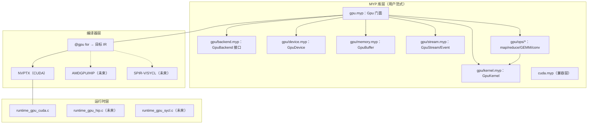

# MYP 通用 GPU 编程范式库 — 设计说明

> 状态：设计稿 v0.8 · 日期：2026-08-12
> 核心主张：**GPU 编程应该像写普通 MYP 一样简单**；库是"一组后端无关、与 MYP 风格一致、
> 按难度渐进披露的模块"。
> v0.3：新增 §10「图级 DL 优化的落点」——确认图级优化可在本框架内以"加一层"实现（MYP 库层）。
> v0.4：新增 §16「未来支持项（暂不实现，仅标记）」——cuDNN/cuBLAS 算子库对接、厂商 BYOC、
> 指令发射边界、量化/稀疏/动态形状、训练支持；路线图标注 F1-F6。
> v0.5：M1（GpuBuffer/GpuDevice）M2（GpuStream/GpuEvent 异步）M3（设备驻留）已实现。
> `@gpu for ... resident(a = dev)` 设备驻留子句落地；ResNet50 GPU 2900ms → 350ms（~8.3x）。
> v0.6：**M3.5 内核优化开启**——`@gpu for` 内核跑 O2 默认管线 + `CodeGenOptLevel::Default`，
> 与宿主 -O 解耦（`MYP_GPU_KERNEL_OPT` 可覆盖 O0-O3）。ResNet50 GPU 稳态 **66ms**
> （2900ms → 66ms，~44x），top-5 与 CPU/onnxruntime 完全一致。
> v0.7：**M4 计算原语全套**——`Gpu.*` L1 宿主数组原语补全（saxpy/dot/mean/方差/范数/
> 转置/float 变体等）+ L2 设备驻留缓冲计算（`GpuOps`：map/add/sub/mul/scale/axpy/GEMM/
> sum/max/min/argmax，double+float）+ `GpuPool` 内存池。修复两个编译器预存 bug：
> `array_byte_sizes_` 跨函数同名污染、内核原子缺 float→double。
> v0.8：**G1 图级融合落地**——推理框架 `onnx_loader.myp` 新增 `fuseConvRelu()` 图 pass
> （在 inferShapes 之后、planMemory 之前）：把 "Conv → Relu"（relu 输入 == conv 输出、
> conv 输出仅该 relu 消费、非图输出）替换为单个 fused 算子（runtime opKind=11，CPU
> `InferOps.convRelu` + GPU `GpuInferOps.convRelu`，conv 输出直接过 relu 不写回中间张量）；
> 融合后的 relu 标记死节点，`planMemory` 融合感知（被消 relu 的输出由 fused conv 承担、
> 中间张量立即释放）。ResNet50 GPU kernel 启动 122 → 89 次；耗时 66-68ms 与基线持平
> （瓶颈在 conv 计算本身，relu 廉价——融合收益主要在少启动/少中间张量往返，为 G2 布局
> 变换铺路）；top-5 与 CPU/onnxruntime 完全一致，MNIST 78/100 无回归，回归 234/234。

---

## 1. 背景与动机

现有 `stdlib/cuda.myp` 提供基础 CUDA 加速（`@gpu for` 语法 + `Cuda/Device/Vectors/Matrix`），
但它：
- 单文件、单后端（CUDA）
- 隐式整体传输，缺显式显存管理
- 缺异步流、内核配置等现代 GPU 抽象

设计目标不是"再加几个 CUDA 函数"，而是**提供一种 GPU 编程范式**：后端无关、模块化、
**低门槛**、**与 MYP 语言浑然一体**，未来可扩展 HIP/ROCm、SYCL、Metal、WebGPU。

---

## 2. 设计目标

| 目标 | 说明 |
|------|------|
| **低门槛** | 90% 的场景像写普通循环一样简单，无需懂设备指针/流/显存 |
| **MYP 风格一致** | API 遵循 MYP 惯用法，`@gpu for` 就是"加个前缀的 for" |
| 后端无关 | 用户代码只碰 `Gpu*`，换后端不改代码 |
| 模块化 | 一组文件，按职责划分，可独立演进/测试 |
| 可回退 | 无 GPU 自动 CPU 回退，结果一致 |
| 渐进披露 | 简单 API 覆盖多数场景；高级 API 按需暴露 |

---

## 3. 设计原则

1. **像写普通 MYP 一样**：GPU 不是"另一门语言"，只是"并行 + 显存"。
2. **默认隐藏复杂度**：后端选择、网格/块、传输、同步全部自动，除非你想控制。
3. **`@gpu for` 是一等公民**：MYP 原生语法就是内核写法，库只做编排。
4. **接口驱动**：库依赖 `GpuBackend` 接口，不依赖具体后端。
5. **CPU 回退保底**：任何 GPU 原语都有顺序版。
6. **可测**：每个模块配测试，与 CPU 参考对照。

---

## 4. 易用性：渐进式披露（按难度分 4 层）

核心思想：**难度"按需"上升**——简单用法零配置，高级用法才需要显式管理。

### 🟢 L1 零配置（大多数场景）

```myp
import gpu;

// 逐元素平方 —— 就像写普通 for，只是加 @gpu
@gpu for (long i = 0L; i < n; i = i + 1L) {
    x[i] = x[i] * x[i];
}

// 一行归约（自动选后端、自动 CPU 回退）
double s = Gpu.sum(x, n);
double m = Gpu.max(x, n);
int    k = Gpu.argmax(x, n);

// 一行 GEMM（不关心任何底层细节）
Gpu.gemm(A, B, C, m, n, k);
```

**用户需要知道的：`import gpu;` + `@gpu for` + 几个 `Gpu.*` 函数。** 其余全自动。

### 🟡 L2 显式缓冲（要复用/性能时）

```myp
// 把数组"钉"在显存里，多次运算不反复传输
GpuBuffer buf = new GpuBuffer(x, n);       // 分配 + H2D 一次
Gpu.mapBuf(buf, buf, n);                   // 设备内运算
buf.copyToHost(x, 0, 0, n);                // 需要时再拷回
buf.free();                                // 显式释放（也可交给 ARC）
```

### 🟠 L3 异步 / 流（要重叠传输与计算时）

```myp
GpuStream s = new GpuStream();             // 一条命令流
Gpu.asyncCopy(x, buf, s);                  // 异步 H2D
Gpu.mapBufAsync(buf, buf, n, s);           // 异步内核
Gpu.asyncCopy(buf, y, s);                  // 异步 D2H
s.sync();                                  // 等全部完成
```

### 🔴 L4 底层（自定义内核 / 多后端 / 极端性能）

```myp
GpuDevice.setCurrent(1);                   // 选设备
GpuKernel.launch(kernel, work, 512, stream); // 显式块大小
GpuBackend.name();                         // 当前后端："CUDA" / "HIP" ...
```

**规则：除非主动进入 L2-L4，否则永远停在 L1。** 这正是"降低编程难度"的关键。

---

## 5. MYP 风格契约

GPU 库的每个 API 都必须"像 MYP 写的"，遵循以下契约：

### 5.1 命名与组织
| MYP 惯例 | GPU 库遵循 |
|---------|-----------|
| 工具类用 `static:`（如 `Math`/`Str`/`Console`） | `Gpu`、`GpuDevice`、`GpuKernel` 用 `static:` |
| 有状态对象用 `action:` + `@constructor`（如 `InferenceRuntime`） | `GpuBuffer`、`GpuStream` 用 `action:` + `@constructor` |
| 方法 camelCase，类 PascalCase | `sum`/`argmax`/`mapBuf`；`GpuBuffer`/`GpuStream` |
| 索引用 `int`，大数/句柄/字节用 `long` | 设备句柄用 `long`，元素索引用 `int` |
| `double` 是默认浮点，`float(...)` 显式用于性能 | 计算默认 `double`，性能路径提供 `*F` 变体 |

### 5.2 内核 = `@gpu for`（不加语法糖）
- 内核编写**复用 MYP 原生 `@gpu for`**，不发明新的内核语言。
- `@gpu for` 块内就是普通 MYP 语句（循环/条件/算术），心智模型与宿主代码一致。
- 可选注解（如 `@grid`/`@block`）只影响启动，不影响内核语义。

### 5.3 风格样板

```myp
// 工具类样板 —— 与 Math/Str 一致
class Gpu {
    static:
        double sum(double[] a, long n) {
            // 有 GPU 走 @gpu for，否则 CPU 顺序
            if (GpuBackend.available() == 1) { ... }
            // CPU 回退
            double s = 0.0; ...
        }
}

// 有状态对象样板 —— 与 InferenceRuntime 一致
class GpuBuffer {
    action:
        @constructor GpuBuffer(double[] host, int n) {
            dev_ = GpuBackend.alloc(...);          // 分配
            GpuBackend.copyH2D(dev_, host, ...);   // H2D
        }
        void copyToHost(double[] host, ...) { ... }
        void free() { ... }
    property:
        long dev_;      // 设备句柄
        int n_;
}
```

### 5.4 返回码风格
- 成功/失败用 `int`（0/1/-1），与现有 stdlib 一致；不轻易抛异常。
- 内存/资源类提供 `free()`，同时依赖 MYP 的 ARC 兜底。

### 5.5 "无魔法"原则
- 除了 `@gpu for`（已是语言特性）和可选注解，**不引入新语法**。
- 一切用 MYP 现有能力表达：类、方法、数组、循环。

---

## 6. 总体架构



---

## 7. 模块划分（一组文件）

```text
stdlib/
├── gpu.myp                        # 门面：Gpu 命名空间（后端无关高层 API）
├── cuda.myp                       # 兼容层：现有 Cuda/Device/Vectors/Matrix（保留）
└── gpu/
    ├── backend.myp                # GpuBackend 接口 + 后端注册表
    ├── backend_cuda.myp           # CUDA 后端实现（当前默认）
    ├── backend_hip.myp            # (未来) AMD HIP/ROCm
    ├── backend_sycl.myp           # (未来) Intel oneAPI SYCL
    ├── device.myp                 # GpuDevice：设备查询/选择
    ├── memory.myp                 # GpuBuffer：显存缓冲 + 内存池
    ├── stream.myp                 # GpuStream / GpuEvent
    ├── kernel.myp                 # GpuKernel：网格/块配置 + 启动
    ├── math.myp                   # Device：设备端数学（libdevice 映射，从 cuda.myp 迁移）
    ├── ops/
    │   ├── elementwise.myp        # map / zip / binary
    │   ├── reduce.myp             # sum / min / max / argmax / scan
    │   ├── linalg.myp             # GEMM / 矩阵
    │   └── cnn.myp                # 卷积 / 池化（对接推理框架）
    └── tests/
        ├── test_buffer.myp
        ├── test_stream.myp
        └── test_ops.myp
```

导入关系：
```myp
import gpu;                        // 唯一用户入口（门面）
import gpu.backend;                // 子模块：点分名 → stdlib/gpu/backend.myp
import gpu.memory;                 //          → stdlib/gpu/memory.myp
import "./my_local.myp";           // 用户本地文件：相对路径（保留）
```

> **import 机制（M1 已改，Python/Java 风格点分模块名）**：
> - `import a.b.c;` 点分名 → 子目录层级 `stdlib/a/b/c.myp`（parser 支持
>   `identifier('.'identifier)*`；`main.cpp loadModule` 用 `dotToSlash` 映射，
>   扁平名保持原行为，扁平形式兜底）。组内互导用 `import gpu.backend;`（名字解析），
>   不再写 `import "./gpu/backend.myp"`。
> - 相对路径 import 解析基准从"用户源码目录"改为**"被导入文件所在目录"**
>   （`sub_dir = getDir(path)`），供用户本地文件使用。
> - 远期可选：`import gpu.memory as gm;` 别名、`--import-path`/`MYP_PATH` 用户库搜索
>   路径（Go/GOPATH）、`package` 声明 + `pub` 可见性（大改，与"低门槛"冲突，不做）。
>
> **实现状态**：`backend.myp` / `backend_cuda.myp` / `device.myp` / `memory.myp`
> （M1）与 `stream.myp`（M2）已实现并验证（`tests/@test/gpu_paradigm.myp`：
> CPU 回退 + GPU 模式均通过）。`kernel.myp` / `math.myp` / `ops/` / `tests/` 为后续里程碑。
> M2 = `GpuStream`/`GpuEvent` + 异步拷贝（H2D/D2H/D2D async，流上排队）；异步内核启动
> 留待 M3（`@gpu for` 需编译器支持流，设计 §12 `__myp_gpu_launch_stream`）。

---

## 8. 核心抽象（API 摘要，MYP 风格）

### 8.1 `GpuBackend`（后端即插即用点）
```myp
class GpuBackend {
    static:
        string name();                 // "CUDA"/"HIP"/"SYCL"
        int available();
        int count();
        int setDevice(int i);
        long alloc(int bytes);         // → 设备句柄
        int free(long dev);
        int copyH2D(long dev, hostPtr, int off, int len);
        int copyD2H(hostPtr, long dev, int off, int len);
        int copyD2D(long dst, long src, int len);
        long streamCreate(); int streamSync(long); int streamDestroy(long);
        int sync();
        int launch(kernel, grid, block, stream, args);
}
```
- 句柄用 `long`（MYP 无指针类型），由 `GpuBuffer` 封装，用户不直接碰。

### 8.2 `GpuDevice`
```myp
class GpuDevice {
    static:
        int count(); int setCurrent(int i); int current();
        string name(int i = -1);
        long memory(int i = -1);         // 显存字节
        int capability(int i = -1);      // 860 = 8.6
        int multiProcessors(int i = -1);
        int warpSize(int i = -1);
        void sync();
}
```

### 8.3 `GpuBuffer`
```myp
class GpuBuffer {
    action:
        @constructor GpuBuffer(double[] host, int n);   // 分配 + H2D
        long devicePtr();
        int size(); int byteSize();
        void copyFromHost(double[] host, int srcOff, int dstOff, int len);
        void copyToHost(double[] host, int srcOff, int dstOff, int len);
        void copyFromBuffer(GpuBuffer src, int srcOff, int dstOff, int len); // D2D
        void free();
    property:
        long dev_;
        int n_;
}
```

### 8.4 `GpuStream` / `GpuEvent`
```myp
class GpuStream {
    action:
        @constructor GpuStream();
        void sync(); void destroy(); long handle();
}
class GpuEvent {
    action:
        @constructor GpuEvent();
        void record(GpuStream s);
        int wait(GpuStream s);
        float elapsedSince(GpuEvent start);
}
```

### 8.5 `GpuKernel`
```myp
class GpuKernel {
    static:
        int launch(void kernel, int work, int blockSize, GpuStream s);
        int launchEx(..., int grid, int block, int shmem, GpuStream s);
}
```

### 8.6 `Gpu`（高层门面，绝大多数用户只用这个）
```myp
class Gpu {
    static:
        // L1：直接对宿主数组（自动传输）
        void map1(double[] in, double[] out, long n);
        void add(double[] a, double[] b, double[] out, long n);
        double sum(double[] a, long n);
        double max(double[] a, long n);
        int argmax(double[] a, long n);
        void gemm(double[] A, double[] B, double[] C, long m, long n, long k);
        // L2：显式缓冲版（*Buf，不反复传输）
        void mapBuf(GpuBuffer in, GpuBuffer out, long n);
        void gemmBuf(GpuBuffer A, GpuBuffer B, GpuBuffer C, long m, long n, long k);
        // L3：异步版（*Async，配流）
        void mapBufAsync(GpuBuffer in, GpuBuffer out, long n, GpuStream s);
        // 每个都有 CPU 回退
}
```

---

## 9. 内存模型与传输策略

| 模式 | 说明 | 适用 |
|------|------|------|
| 隐式（现状） | `@gpu for` 每块自动整块传输 | L1 快速原型 |
| 足迹式 | 按算子访问范围传输 | 中等 |
| **设备驻留（已实现 M3）** | `@gpu for ... resident(a = dev)` 跳过传输，内核直接用设备指针 | L2/L3、大模型推理 |

**设备驻留示例（推理框架已用，ResNet 2900ms → 350ms）：**
```myp
GpuBufferF arenaBuf = new GpuBufferF(arena, cap);   // H2D 一次
long dev = arenaBuf.devicePtr();
// 每个算子：直接操作设备内存，零逐算子传输
GpuInferOps.conv(arena, work, ..., dev);
arenaBuf.copyToHost(arena, 0, 0, cap);              // D2H 一次
arenaBuf.free();
```

**设备驻留示例（推理优化，ResNet 目标 ~50-100ms）：**
```myp
GpuRuntime rt;
rt.begin(arenaBuf);      // H2D 一次
rt.runAll();             // 122 个算子内核，设备驻留，零逐算子传输
rt.end();                // D2H 一次
```

---

## 10. 图级 DL 优化的落点（未来层，架构已预留）

### 10.1 结论：能，且是"加一层"不是"改架构"

框架已经拥有**图 IR**（ONNX 解析后的节点/形状/内存规划），缺的只是一层**图优化 pass**，
而这层是 **MYP 库层**，不动编译器。

```text
ONNX
  → OnnxLoader.parseGraph（图 IR：节点 + 形状 + 内存规划）   ← 已有
  → [新增] GraphOptimizer（图优化 pass 管线）                ← 只加这层
       · 算子融合：Conv+ReLU / Conv+BN / GAP+Flatten
       · 常量折叠（Constant Folding）/ 死算子消除（DCE）
       · 布局变换（NCHW→NHWC，配合 fused kernel）
       · 精度缩放（FP32→FP16/INT8，可选）
  → buildRuntime（优化后图 → runtime ops）
  → run / runGpu
```

### 10.2 两个新组件（都是 MYP 库层）
1. **Graph IR 类**：显式节点/边表示（`GraphNode` / `Graph`），便于 pass 改写。
   （当前图隐含在 loader 的并行数组里，加一层显式表示后 pass 才可变换。）
2. **GraphOptimizer**：有序 pass 管线，`Graph optimize(Graph g)`。

### 10.3 融合机制
- 图 pass：把 `Conv → ReLU` 替换为单个 fused 节点。
- runtime 新增 op kind（如 `ConvRelu`）。
- `ops.myp` / `gpu_ops.myp` 新增 fused kernel（conv 输出直接过 relu，**不写回中间张量**）。
- 收益：少一次 kernel 启动 + 少一次中间张量全局内存往返。

### 10.4 与 GPU 范式的关系
- fused kernel 用 `@gpu for` 写（复用本范式）。
- 配合 `GpuBuffer` 设备驻留（M3）+ 内核优化（M3.5）：融合 + 驻留 + 优化 = ResNet 几十 ms 目标。

### 10.5 可做性分级
| 优化 | 难度 | 说明 |
|------|------|------|
| Conv+ReLU 融合 | 低 | ✅ G1 已实现（runtime fused op + kernel） |
| 常量折叠 / DCE | 低 | ✅ G2 已实现（`foldConstants` / `eliminateDeadNodes`，纯图逻辑） |
| GAP+Flatten 融合 | 低 | ✅ G2 已实现（消除一次拷贝 + 中间张量） |
| 布局变换 | 中 | ✅ G2 已实现（NCHW→NHWC，opt-in；CPU +39%，GPU 朴素内核 -3x 归 F4 平铺） |
| 自动调优 | 中高 | 需基准 + 配置搜索 |
| 量化 FP16/INT8 | 高 | 需新精度内核 + PTQ/QAT（F4） |

### 10.6 与推理框架现状
- `InferenceRuntime` 已是"手动版迷你 DL 编译器"（静态图 + 形状推断 + 内存规划）。
- 融合/布局是它缺的两块；用 `GraphOptimizer` 补上后，接近一个真正的图级编译器。

---

## 11. 后端扩展路径

| 后端 | 编译器 target | 运行时驱动 | MYP 后端文件 |
|------|--------------|-----------|-------------|
| CUDA（当前） | NVPTX | runtime_gpu_cuda.c | backend_cuda.myp |
| HIP/ROCm | AMDGPU | runtime_gpu_hip.c | backend_hip.myp |
| SYCL/oneAPI | SPIR-V | runtime_gpu_sycl.c | backend_sycl.myp |
| Metal | MSL | — | backend_metal.myp |
| WebGPU | WGSL | — | backend_webgpu.myp |

**新增后端 = 4 步**（编译器 target + 运行时驱动 + `backend_*.myp` + 门面注册）。用户代码不变。

---

## 12. 编译器 / 运行时改造点

### 运行时（新增 FFI，供 GpuBackend 调用）
```
__myp_gpu_alloc(bytes) -> long
__myp_gpu_free(long)
__myp_gpu_copy_h2d(long dev, hostArr, srcOff, dstOff, len)
__myp_gpu_copy_d2h(hostArr, long dev, srcOff, dstOff, len)
__myp_gpu_copy_d2d(long dst, long src, len)
__myp_gpu_stream_create() -> long
__myp_gpu_stream_sync(long)
__myp_gpu_stream_destroy(long)
__myp_gpu_sync()
__myp_gpu_launch_stream(kernel, grid, block, stream, args)
```
现有 `myp_gpu_alloc/free/to_device/to_host` 已有，补 d2d / stream / async 与 FFI 暴露。

### 编译器
- `@gpu for` 增加**设备驻留模式**：捕获数组为显式 `GpuBuffer` 时跳过自动传输。
- 启动支持显式 grid/block/stream。
- target 抽象：NVPTX 当前，预留 AMDGPU/SPIR-V。
- **开启内核优化（重要，见下方"内核优化"）**。

### 内核优化（M3.5 已实现）

**现状（M3.5 落地后）**：`codegen_gpu.cpp` 对每个 `@gpu for` 内核模块跑 LLVM 默认
**O2 模块管线**（SROA/InstCombine/GVN/LICM/循环展开/向量化，PassBuilder 带 NVPTX
TargetMachine 注册 TTI 成本模型），PTX 生成用 `CodeGenOptLevel::Default`（O0 时 None）。
- 等级默认 **O2、与宿主 -O 解耦**，`MYP_GPU_KERNEL_OPT=O0/O1/O2/O3` 可覆盖。
- 已回归验证（GPU 结果 == CPU 参考）：`tests/@test/gpu_paradigm.myp` 5 用例全过、
  ResNet50 top-5 与 CPU/onnxruntime 一致。
- 实测：设备驻留 350ms → **66ms 稳态**（卷积大循环受益于展开/调度）。
- 注：首次运行含 PTX→SASS JIT 预热（~120ms），稳态为准。

### 语法（可选，低优先）
- `@gpu_resident`：标记数组常驻显存（当前用 `resident(arr = dev)` 子句，见 §8.3 附注）。
- `@grid`/`@block`：启动配置注解。
- `@opt(O3)`：内核对齐到指定优化等级（当前用 `MYP_GPU_KERNEL_OPT` 环境变量）。

---

## 13. 迁移与兼容

| 现有用法 | 迁移 |
|---------|------|
| `import cuda;` + `Cuda.*` | 保留（兼容层转发到 `GpuDevice`） |
| `Device.*` 内核数学 | 移到 `gpu/math.myp`，cuda.myp 转发 |
| `Vectors.*`/`Matrix.*` | 保留；新代码用 `Gpu.*` |
| 推理框架 `gpu_ops.myp`/`runGpu()` | 逐步改到 `GpuBuffer` 设备驻留 |

---

## 14. 路线图

| 里程碑 | 内容 | 是否动编译器 |
|--------|------|------------|
| **M1** | 显式显存：`GpuBackend` 接口 + `GpuBuffer` + `GpuDevice` | 否（纯运行时 FFI + 库层） |
| **M2** | 异步：`GpuStream`/`GpuEvent` + async 拷贝/启动 | 否 |
| **M3** | 设备驻留 + 推理优化（ResNet → ~50-100ms） | 是（@gpu for 设备驻留） |
| **M3.5** | **内核优化开启**：`@gpu for` 内核跑 O2/O3 pass + `CodeGenOptLevel::Aggressive` | 是（codegen_gpu.cpp） |
| **M4** | `Gpu.*` 计算原语全套 + 内存池 + CPU 回退 | 否 |
| **M5** | 多后端（HIP/SYCL/Metal 实验） | 是（target 抽象） |
| **G1** | **图级优化（推理框架）**：Conv+ReLU 融合已实现（`fuseConvRelu` pass，opKind=11，ResNet kernel 122→89） | 否（纯 MYP 库层） |
| **G2** | **图级进阶已实现**：GAP+Flatten 融合（`fuseGapFlatten`）、DCE（`eliminateDeadNodes`）、常量折叠（`foldConstants`）、布局变换 NCHW→NHWC（`layoutNHWC`，opt-in）；精度缩放 FP16/INT8 转 F4 未来项 | 否 |
| **G3** | **BatchNormalization 已实现**：独立 BN 算子（opKind 17/18，CPU+GPU）**+ Conv+BN 融合**（`fuseConvBN`，BN 折进卷积权重/偏置，随后 G1 再融合 Conv+ReLU → 单算子） | 否 |
| **G4** | **通用激活算子 + 真实带 BN 模型验证已实现**：ReLU6/LeakyRelu/SiLU/HardSwish/Clip（opKind 19-23，CPU+GPU）；真实 ResNet18（resnet18_v1_7.onnx，20 BN 全融合）端到端 top-5/output sum 与 ORT 逐位一致（GPU 51ms） | 否 |
| **G5** | **图优化器解耦为通用组件已实现**：新增 `graph.myp`（`Graph`：格式无关图 IR + 8 pass + planMemory + buildRuntime + 图构建 API）；`onnx_loader.myp` 变薄为纯 ONNX 解析器；OnnxLoader 公共接口不变，infer_tests 零改动 | 否 |
| **F7** | **通用 ONNX 运行器已实现**（`run_onnx.myp` + `run_onnx.sh`：任意 ONNX → 推理 → top-k / out.bin） | 否 |
| **F8** | **算子覆盖扩展——第一批（Concat/Reshape/Transpose/Slice）已实现**（opKind 24-27，CPU+GPU）；Resize/ConvTranspose/ReduceMean/LayerNorm/GELU 仍为未来项（详见 §16） | 否 |
| **F1-F6/F9** | **未来支持项**（暂不实现，仅标记）：cuDNN/cuBLAS 算子库对接、厂商 BYOC、量化/稀疏/动态形状、训练支持、LLM 推理 | 视项而定 |

> **M5 暂缓（2026-08-12）**：多后端（HIP/ROCm、SYCL、Metal、WebGPU）需要对应硬件才能
> 验证。当前无 AMD/Intel/Apple 硬件，故**暂不实现**。扩展路径（§11：编译器 target +
> 运行时驱动 + `backend_*.myp` + 门面注册）与后端无关设计已就绪，待有硬件时按 §11 落地。

> **M1/M2/M3 已实现（2026-08-12）**：M1 = `GpuBackend`/`GpuBuffer`/`GpuDevice`；
> M2 = `GpuStream`/`GpuEvent` + 异步拷贝；M3 = `@gpu for ... resident(a = dev)` 设备驻留
> 子句（被标记数组跳过 H2D/D2H/释放，内核直接用 dev 设备指针）。推理框架 `runGpu()` 改为
> "整块 arena 一次 H2D → 各算子 resident 直接算 → 一次 D2H"。
>
> **M3.5 已实现（2026-08-12）**：`codegen_gpu.cpp` 对内核模块跑 LLVM 默认 O2 管线
> （SROA/InstCombine/GVN/LICM/循环展开/向量化，PassBuilder 带 NVPTX TargetMachine 注册 TTI），
> PTX 生成用 `CodeGenOptLevel::Default`（O0 时 None）。等级默认 O2、与宿主 -O 解耦，
> `MYP_GPU_KERNEL_OPT=O0/O1/O2/O3` 可覆盖。首次含 PTX→SASS JIT 预热，稳态为准。
>
> **M4 已实现（2026-08-12）**：`Gpu.*` L1 原语补全 + L2 设备驻留缓冲计算（`stdlib/gpu/
> ops.myp` `GpuOps`，基于 M3 `resident()`）+ `GpuPool` 内存池（`stdlib/gpu/memory.myp`）。
> 同时修复两个编译器预存 bug（M4 暴露）：
> ① `array_byte_sizes_` 缓存按函数作用域（键记录所属函数，读取仅信任当前函数）——
>    否则 GpuOps 的短名局部（a/b/o，`float[1]`=4B）会污染后续函数同名参数的
>    `@gpu for` 传输字节数（`Vectors_add` 只传 4 字节 → 全 0）。
> ② 内核原子路径补 float→double fpext（`Atomic.addDouble` 传 float 值时原子写错）。
>
> **ResNet50 GPU 全旅程**：2900ms（逐算子整块传输）→ 350ms（M3 设备驻留，~8.3x）
> → **66ms 稳态**（M3.5 内核 O2，~44x），top-5 与 CPU/onnxruntime 完全一致；MNIST 78/100
> 与 CPU 一致；`tests/@test/gpu_paradigm.myp` 6 用例 CPU 19 + GPU 57 断言全过；回归 234/234。
>
> **G1 已实现（2026-08-12）**：推理框架图级优化第一步落地（§10）。`onnx_loader.myp`
> 新增 `fuseConvRelu()` 图 pass——`inferShapes()` 之后、`planMemory()` 之前调用，把
> "Conv → Relu" 对替换为单个 fused 算子：
> · fused 内核：`ops.myp` `InferOps.convRelu`（CPU）+ `gpu_ops.myp` `GpuInferOps.convRelu`
>   （GPU，参数与 conv 相同，仅 y 处写 max(sum,0)）；runtime `addConvRelu`（opKind=11）。
> · 融合条件：relu 输入 == conv 输出、conv 输出仅被该 relu 消费（ResNet 残差 Add 分支
>   多消费者时跳过）、conv 输出非图输出（防把图输出写丢）。
> · 死 relu 节点 `nType_[j]=""`；`nFused_/nFusedBy_/nFusedOut_` 记录映射；`planMemory`
>   融合感知（producer 覆写 + lastUse 跳过死节点 + 中间张量立即可复用）。
> · 实测：kernel 启动 122 → 89（33 对融合，残差分支使非全部 53 对可融合）；ResNet50 GPU
>   66-68ms 与基线持平——融合收益在少启动 + 少中间张量往返，瓶颈是 conv 计算本身，
>   relu 为廉价算子故耗时无显著变化；正确性：top-5 与 CPU/onnxruntime 逐位一致，MNIST
>   78/100 无回归（MLP 无 Conv → pass 为 no-op），GPU `gpu_paradigm` 57 断言全过，回归 234/234。
>
> **G2 已实现（2026-08-12）**：推理框架图级进阶（§10.5 除量化外全部落地，纯 MYP 库层）：
> · **GAP+Flatten 融合**（`fuseGapFlatten`，复用 G1 的 `nFused_/nFusedOut_` 机制）：
>   GAP 直接写 flatten 输出张量，消除一次 flatten 拷贝 + 中间张量 [N,C,1,1]（batch==1 才
>   融合，保证 FC_ACT 转置登记与 gapool 顺序写入一致）。ResNet kernel 89→88。
> · **DCE**（`eliminateDeadNodes`）：fixpoint 删输出无活消费者且非图输出的节点，以
>   `effectiveOut`（融合节点的 nFusedOut_）判活性；融合消掉的中间张量经 `markDeadTensor`
>   （`shDead_`）在 planMemory/buildRuntime 中彻底不分配/不登记。
> · **常量折叠**（`foldConstants`，在 inferShapes 之前）：解析 Constant 节点 value 属性
>   （AttributeProto `t`=field 5 的 TensorProto，float 初值），注册为持久张量（`wRole_=4`
>   直接拷贝，新 kind `FC_C`=6），节点标死。无 Constant 支持的模型（带折叠节点）因此可加载。
> · **布局变换 NCHW→NHWC**（`layoutNHWC`，`MYP_LAYOUT_NHWC=1` opt-in）：把 CNN 主干
>   （Conv/MaxPool/Add/Relu 链）切到 NHWC——图输入/非 NHWC 生产者处插入 `NCHW2NHWC` 转置
>   节点（opKind=12），Conv 权重装载时转置 [Cout,Cin,KH,KW]→[Cout,KH,KW,Cin]（`wNHWC_`），
>   NHWC 张量以 (N,H,W,C) 元数据登记（`shNHWC_`），新增 NHWC 内核（conv/convRelu/maxpool/
>   gapool，opKind 13-16，CPU+GPU 双份）。GAP 为布局无关边界（读 NHWC 产 [N,C]）。
> · **拓扑排序**（`topoSort`，Kahn）：转置节点在尾部追加，必须重排保证先于消费者执行
>   （这也是内存规划/接线改用 `planOrder_` 的原因，producer/lastUse 以拓扑位置计）。
> · 实测：ResNet50 两布局输出 sum 逐位一致（336.658），top-5 一致；**CPU NHWC 14.4s→8.8s
>   （~39% 提速，通道连续归约改善缓存）**；**GPU NHWC 66ms→208ms（朴素每线程一元素内核
>   无共享内存分块，channel-innermost 使权重读取跨线程非合并；需平铺内核才发挥 NHWC 优势，
>   转 F4）**——故布局变换 opt-in 默认关（GPU 仍用 NCHW）。常量折叠端到端验证：
>   `const_fold_test.onnx`（Constant→Add→Relu）输出与 onnxruntime 逐位一致；新增
>   `tests/@test/graph_opt.myp` 4 用例 214 断言（NHWC 内核与 NCHW 等价）；回归 235/235。
>
> **G2 说明**：`InferenceRuntime` 已是迷你图编译器（图 IR + 形状推断 + 内存规划 + 图 pass
> 管线：fold → inferShapes → classify → fuseConvBN(G3) → fuseConvRelu → fuseGapFlatten →
> DCE → layout → topoSort → planMemory → buildRuntime）。精度缩放 FP16/INT8 需新精度内核
> + PTQ/QAT，归 F4。
>
> **G3 已实现（2026-08-12）**：BatchNormalization 支持（真实 CNN 最常用缺失算子，纯 MYP 库层）：
> · **Conv+BN 融合**（`fuseConvBN`，在 G1 之前）：Conv → BatchNormalization（conv 输出仅被
>   该 bn 消费、非图输出）→ 把 BN per-channel 参数折进 conv——
>   `invStd[oc]=scale/sqrt(var+eps)`，`W'[oc]=W[oc]*invStd[oc]`，
>   `B'[oc]=(B_conv[oc]-mean[oc])*invStd[oc]+B_bn[oc]`。折叠在 `writeWeight` 时按
>   `wBN_/wBNNode_` 应用（含 NHWC 转置路径，按 oc 缩放可交换）；BN 节点 + 4 参数张量标死；
>   conv 有效输出改写为 BN 输出（`nFused_/nFusedOut_`），随后 G1 把 Conv+ReLU 继续融合。
> · **独立 BN 算子**（未融合场景，如 Add→BN）：opKind 17（NCHW）/ 18（NHWC），参数张量
>   scale/bias/mean/var 为 [C] 初始器；eps 以位型 + hasEps 存 runtime，分发时 `F32.toDouble`
>   解析为 double 传给内核（**@gpu for 内核内不能调宿主 F32，也不能声明 double 局部**）。
> · **解析**：`parseNode` 新增捕获 BN 第 3/4 输入（mean/var，`nIn3_/nIn4_`）；`parseAttr`
>   捕获 epsilon（AttributeProto `f`=field 2，wire type 5，`readU32()` 读 4 字节小端）。
> · **G1 增强**：`fuseConvRelu` 改以 `effectiveOut` 匹配（BN 折叠后 conv 有效输出是 BN 输出），
>   且不再盲清 `nFused_`（改由 parseNode 统一复位，避免抹掉 G3 的 BN 融合标记）。
> · **验证**：`bn_main.myp` 端到端——`bn_fold_test.onnx`（Conv→BN→Relu）折叠为**单算子**
>   （bn_fused=1、convRelu_fused=1、ops=1），`bn_standalone_test.onnx`（x→BN→Relu）
>   ops=2；两者 CPU/GPU × NCHW/NHWC 四配置输出与 onnxruntime 逐元素一致（max diff <1e-6）。
>   新增 `tests/@test/bn_opt.myp` 2 用例 84 断言（batchnorm 与手工参考一致 + NHWC 等价）；
>   回归 **236/236**；ResNet 66ms/88 ops、MNIST 78/100 无回归。
> · **MYP 坑（G3 新记）**：`var`、`ref` 都是保留字（不能用做局部名）；`float - double`
>   混合算术不会自动提升（先 `double xv = arena[...]` 再算）。
>
> **G4 已实现（2026-08-12）**：通用激活算子 + 真实带 BN 模型端到端验证（纯 MYP 库层）：
> · **新增 5 个激活算子**（runtime opKind）：ReLU6=19、LeakyRelu=20（alpha 经 opP0/opP1 +
>   分发 `F32.toDouble`）、SiLU=21、HardSwish=22、Clip=23（min/max 经 opP0/opP1）。CPU
>   `ops.myp` + GPU `gpu_ops.myp` 双份内核；`tests/@test/act_opt.myp` 5 用例 48 断言。
> · **ReLU6 不是标准 ONNX 算子**（真实模型用 `Clip(x,0,6)`）→ 以通用 Clip 为准（opset13+
>   的 min/max 是**输入张量**，由 loader 从初始器解析为标量）。SiLU 需 opset≥14，
>   onnx 1.22/ort 1.28 不注册（无法 ORT 校验）→ @test 手工计算验证。
> · **真实模型 resnet18_v1_7.onnx**（ONNX Model Zoo，45MB，69 节点：20 Conv+20 BN+17 Relu+
>   8 Add+MaxPool+GAP+Flatten+Gemm；**全部 20 个 conv 无 bias**——Caffe2 导出风格，bias 参数
>   随 BN 折叠给出）。加载后 bn_fused=20、ops=39；`r18_main.myp`：CPU 5s、GPU 51ms、
>   **output sum 0.101238、top-5 [975,976,978,977,449] 与 onnxruntime 完全一致**。
> · **三个连环 bug（G4 核心）**：① 无 bias conv 段错误（`bc=-1` 时 `tOff_[-1]` 越界）→
>   8 处 conv 分发点 + 4 个 conv 内核全加 `bOff>=0` 守卫；② 折 BN 后无 conv-bias 张量可折
>   → fuseConvBN 合成 bias（`nOut0_[conv]+"#bnb"`，`wBNOnly_=1`，`B'[oc]=(0-mean)*invStd+bnBias`）；
>   ③ **ROOT BUG：`nFused_` 标志过载**——buildRuntime Conv 分支查 `nFused_==1` 发
>   addConvRelu，但 nFused_ 同时被 fuseConvBN 和 fuseConvRelu 置位 → BN-only 融合的 conv
>   （后接残差 Add 而非 Relu）被错误套上 ReLU。修复：新增 `nRelu_[512]` 标志**仅**由
>   fuseConvRelu 置位，buildRuntime 用 nRelu_ 决定 convRelu vs conv。回归用例
>   `bn_norelu_test.onnx`（Conv→BN→Add→Relu，bn_fused=1、ops=3）。
> · **调试**：中间张量区域复用导致读回是垃圾 → `MYP_NO_REUSE=1` 禁用区域复用取有效中间值
>   （`noReuse_`）；runtime 加调试访问器 `tensorOff(tid)`。
> · **验证**：`act_main.myp`（act_test.onnx，opset14：Clip/LeakyRelu/HardSwish 并行分支）
>   CPU/GPU/NHWC 与 ORT 一致（max diff<3e-8）；`bn_main.myp` 3 用例全过（含 bn_norelu，
>   max diff 3.8e-6）；resnet18 top-5/output sum 与 ORT 逐位一致；ResNet50 336.658/88 ops、
>   MNIST 78/100 无回归；回归 **237/237**（新增 act_opt）。
> · **MYP 坑（G4 新记）**：`data` 是保留字（GPU BN 内核局部名用 `variance`）；LLVM verify
>   报 clip 内核 `lo = arena[...]` 赋值不自动做 float→double 扩展 → 先声明 double 初值
>   变量 `double mv = arena[...]; lo = mv;`。
>
> **G5 已实现（2026-08-12）**：图优化器解耦为通用组件（纯 MYP 库层）：
> · **`graph.myp` 新增 `class Graph`**：格式无关的图 IR（权重/节点/形状/规划/张量表）+
>   全部图 pass（foldConstants/inferShapes/classifyShapes/fuseConvBN/fuseConvRelu/
>   fuseGapFlatten/eliminateDeadNodes/layoutNHWC/topoSort）+ planMemory + buildRuntime +
>   **图构建 API**（setFile/addWeight/addShapeD/addGraphOutput/beginNode/endNode/nodeType/
>   nodeIn/nodeOut/nodeInt→`NodeField` 字段码）+ optimize(rt) 管线编排。
> · **`onnx_loader.myp` 变薄**（1432→340 行）：只留 protobuf 解析，把 ONNX 属性名映射为
>   `NodeField` 字段码填充 Graph。
> · **MYP 约束（G5 新记）**：① `function:` 区方法是**类私有**（跨类不可调）→ 图构建 API
>   必须放 `action:`；② 跨类**不能直接读字段**（`a.x_[0]` 报 "expected function name"）
>   → 用公开方法暴露接口；③ 跨类方法调用正常（`g_.nodeInt(...)` 可调）。
> · **OnnxLoader 公共接口不变**（load/tensorId/bnCount/fuseCount/...）→ infer_tests 零改动；
>   Graph 持 `file_` + 自己的 `pb_`（foldConstants/writeWeight 需从原始字节读权重）。
> · **验证**：MNIST 78%、r18 0.101238（CPU/GPU）、resnet50 336.658（含 NHWC）、bn 3 用例、
>   act/const 全过，输出与重构前逐位一致；回归 **237/237**。
>
> **F1-F6 说明**：cuDNN 当前未安装（仅 cuBLAS 已装）；cuDNN 对 conv 收益巨大但暂不排期。
> 均先标记为未来支持项，不阻塞当前里程碑。

---

## 15. 风险与权衡

| 风险 | 应对 |
|------|------|
| 编译器改动大 | M1/M2 纯运行时+库层，不动编译器 |
| long 句柄安全 | GpuBuffer 封装 + ARC 兜底 + 调试断言 |
| 两套传输模型混淆 | 文档明确：L1 隐式，L2+ 显式；默认隐式 |
| 后端差异 | 接口最小化，编译器 target 逐步做 |
| ~~MYP 无泛型~~（已修正：MYP 有**单态泛型**，`ArrayList<T>` 等） | GpuBuffer 仍按元素字节分型（GpuBuffer/GpuBufferF）：元素字节数是**值**（4/8）非类型，单态泛型参数是类型；dtype 维度未来可用泛型 `T` 单态化（如算子内核） |
| 简单 API 掩盖传输开销 | 文档给性能提示；*Buf/*Async 供需要的人 |

---

## 16. 未来支持项（暂不实现，仅标记）

> 以下能力经评估可行且有价值，但**暂不纳入当前里程碑**，先在此标记，供后续排期参考。

### F1. cuDNN / cuBLAS 算子库对接（BYOC）
- **cuDNN**：卷积/池化/激活等。NCHW 行优先 float 与我们的 arena 布局直接匹配；
  需先安装（`pip install nvidia-cudnn-cu12` 或 CUDA toolkit）；`dlopen libcudnn` 与 libcuda 同模式。
- **cuBLAS**：GEMM（`libcublas.so.12` 系统已装）。适合 GEMM 重的模型。
- 收益：conv 可较朴素内核提速 10-100x；真实 DL 框架均调 cuDNN。
- 最佳搭配：设备驻留（M3）——arena 常驻显存，cuDNN 直接在设备指针上跑。
- 位置：`gpu/` 库的"算子库层"；conv 分发：cuDNN 可用则用，否则回退 `@gpu for` 内核。

### F2. 厂商算子库 / 专用加速器（BYOC 扩展）
- 昇腾 CANN、oneDNN、NPU SDK 等：**"调用发射"而非"指令发射"**。
- 用 `GpuBackend` 接口抽象：算子 → 厂商库调用作为一类后端。

### F3. 指令发射能力边界（LLVM 后端 vs BYOC）
- 通用硬件（x86/ARM/CUDA/HIP）：**能**直接指令发射（LLVM X86/AArch64/NVPTX/AMDGPU 后端），
  已在 CUDA 上实现（`@gpu for` → PTX → SASS）。缺的只是内核优化等级（M3.5）与多 target 抽象（M5）。
- 专用加速器（NPU/昇腾/TPU）：**不能**直接发射，走厂商库调用（F2）。

### F4. 量化 / 稀疏 / 动态形状专项变换
- 量化：PTQ/QAT、FP16/INT8/INT4。
- 稀疏：剪枝、稀疏 kernel、2:4 稀疏、低秩。
- 动态形状：形状特化、分桶（bucketization）。
- 位置：`GraphOptimizer`（G1/G2）的专项 pass，横切图/算子两层。

### F5. 训练支持（若未来做）
- 自动微分/反向图、梯度检查点、混合精度训练、分布式/通信优化。

### F6. 业界 DL 编译器流水线对照（本框架现状）
| 流水线 | 本框架现状 |
|--------|-----------|
| 模型 → 计算图 | ✅ OnnxLoader → 图 IR |
| 图层面优化 | ⭕ G1/G2（计划） |
| 算子划分/内存规划/调度 | ✅ planMemory + runtime 调度；缺多设备划分 |
| 算子层面 CodeGen | ✅ `@gpu for`；缺自动调优/布局（M3.5 相关） |
| 硬件指令发射 | ✅ CUDA NVPTX；未来 HIP/SYCL |
| 运行时/内存/设备调度 | ✅ InferenceRuntime；缺显式流/多设备（M2） |
| 量化/稀疏/动态形状 | ❌ F4 |
| 算子库对接（cuDNN/cuBLAS） | ❌ F1 |

### F7. 通用 ONNX 运行器（消除新模型样板）——已实现（2026-08-12）
- **实现**：`deeplearning/infer_tests/run_onnx.myp`——通用 CLI
  `run_onnx <model.onnx> <inputName> <outputName> <input.f32> [--topk N] [-o out.bin]`。
  加载任意 ONNX → 喂 .f32 输入 → 推理（CPU/GPU）→ 打印 top-k 或 output sum/first，
  可 `-o out.bin` 写 float32 二进制输出（供 ORT 交叉校验）。
- **配套**：`pb.myp` `F32` 补 `toBits(double)`（double→float32 位型，纯 MYP
  IEEE754 编码 round-to-nearest）——MYP 无 bit_cast，供写 .bin 输出。
- **验证**：resnet18 top-5 [975,976,978,977,449] 与 ORT 一致，out.bin 位级正确
  （sum 0.101238）；GPU 21ms；非分类模型（bn_fold ops=1）；回归 237/237。
- **说明**：跑新模型零样板——放 .onnx + .f32 输入即可。已实现，无需再归档。

### F8. 算子覆盖扩展（高频缺失算子）——第一批（Concat/Reshape/Transpose/Slice）已实现（2026-08-12）
- **第一批已实现**：`Concat`（2-3 输入，axis 0-3，CPU+GPU）、`Reshape`
  （shape 初始器，-1 推断 / 0 复制维）、`Transpose`（perm 0-4 元，缺省反转）、
  `Slice`（starts/ends/axes/steps，支持负索引 / 负 step 反向 / INT64_MAX，
  CPU+GPU），opKind 24-27。解锁 DenseNet / YOLO neck / EfficientNet / ViT 等。
- **实现**：graph.myp（NodeField PERM0-3/PERM_N + nP0_..nPc_ 数组 + `readI64Init`
  读 int64 初始器（全 int64 long，支持 INT64_MAX 检测）+ `sliceAxis` helper +
  `markInt64Param`（int64 参数初始器标死，不登记为 f32 张量）；inferShapes/bindRuntime
  分支）+ runtime（addReshape/addConcat/addTranspose/addSlice + 分发）+
  ops/gpu_ops（内核）。关键点：
  - 图维度（shD0..3）即内存行优先维（NCHW 与 NHWC 均适用），内核直接用图维度
    而非 runtime 的 tN_/tC_/tH_/tW_（NHWC 下会交换）；
  - concat 内核用各输入自身轴长计算 inFlat（batch>1 时 stride 才正确）；
  - `classifyShapes`：4D 通用常量（Concat 输入）标记 CNN 激活 + 直接拷贝；
    4D 图输入（首消费者为 Concat/Transpose/Reshape）按 CNN 激活定型；
  - Slice 缺省 axes = [0..len(starts)-1]（ONNX 语义）；GPU 内核轴循环需展开
    （内核内 while 导致 GPU codegen 失败）。
- **验证**：合成 `tensorops_test.onnx`（Concat+Reshape+Transpose 链）+ `slice_test.onnx`
  （四路 Slice：正区间/负索引/负 step 反向/INT64_MAX + 两段 Concat）+ ORT 交叉校验
  （`tools/make_tensorops_onnx.py`/`tools/make_slice_onnx.py` 生成 + `tensorops_main.myp`/
  `slice_main.myp` 端到端）——CPU/GPU 均 max diff=0（位精确）；另测 3 输入 concat、
  axis=0/1/2 batch>1、2D FC concat、Transpose batch>1 全部位精确；ResNet18/50 回归
  正常；回归 237/237。
- **已知限制**：2D/FC concat 输出平铺正确（作图输出时与 ORT 一致），
  但 concat 后接 FC 权重算子时维度交换语义未充分验证（罕见路径）。
- **剩余 F8 算子**（排期见 §16）：`Resize`/`ConvTranspose`/`ReduceMean`
  → `LayerNorm`/`GELU`（Transformer 门槛）。加算子流程同第一批。
- **状态**：第一批已实现（2026-08-12）；其余仍归档标记。

### F9. LLM（生成式 Transformer）推理——已归档（暂缓）
- **差距**：① 算子缺 `Embedding`/`Gather`/`LayerNorm`/`GELU`/RoPE（Cos/Sin/Concat/Slice）；
  ② **动态形状**——decode 循环 KV cache 逐 token 增长，而当前框架静态形状
  （inferShapes 固定维度 + planMemory 固定 arena）；prefill（静态）或可跑，decode 不行；
  ③ 精度仅 FP32（7B 模型 28GB）；④ GEMM 朴素无优化（LLM 是 matmul 密集）；⑤ KV cache 未建模。
- **可增量路径**：先跑小模型静态 prefill（补 Embedding/Gather/LayerNorm/Reshape/Transpose）→
  再加 KV cache 动态形状支持 decode。
- **状态**：已归档标记（2026-08-12），与 F8 的 Transformer 算子高度重叠。

---

## 17. 结论

这套设计把 GPU 能力组织成**一组后端无关、MYP 风格一致、渐进披露难度的库**：
- **低门槛**：90% 用户只写 `@gpu for` + `Gpu.*`，像写普通 MYP。
- **风格一致**：`static:` 工具类 + `action:` 对象类，`@gpu for` 原生内核，无新语法。
- **可扩展**：模块化文件 + `GpuBackend` 接口，未来 HIP/SYCL/Metal 即插即用。
- **图级可演进**：图 IR 已存在，`GraphOptimizer`（融合/折叠/DCE/布局）作为 MYP 库层
  加一层即可实现，`InferenceRuntime` 可逐步逼近真正的图级 DL 编译器。
- **渐进**：M1（GpuBuffer）→ M2（异步）→ M3（设备驻留）→ M3.5（内核优化）→ G1/G2（图级优化）。

**下一步建议：从 M1 开始实现，先验证"显式显存 + GpuBuffer"这条范式链路；随后 M3.5 内核优化
与 G1 图融合是两条"低成本高收益"的加速路径。**
