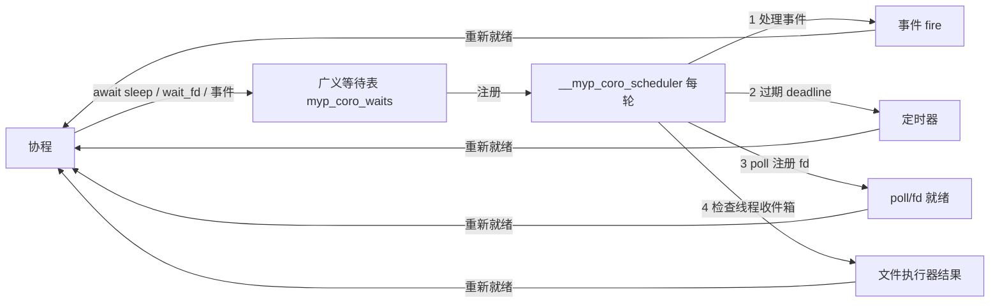

# MYP 异步 IO 统一抽象设计（Async I/O）

> 状态：**已实施（P1 定时器 / P2 套接字 / P3 文件执行器 / P4 统一 waitAnyOf）** — 对应 `docs/next_improvements.md` §五-5
> 关联：语言规格 v1.0（`docs/grammar.md`）、协程设计 `docs/coro.md`、现有实现
> （`src/runtime/runtime.c` §Coroutine + `src/codegen/codegen.cpp` + `stdlib/coro.myp`）
> 目标：把"等某件事完成"（事件 / 文件 / 网络 / 睡眠）统一到 `await` + 协程调度器
> 一个机制下，对标 Rust tokio / Node 事件循环 / C# async 的 reactor + executor 模型。
> 全部 additive（无破坏性语法变更）。

---

## 1. 背景与现状

### 1.1 已有协程能力（C1-C10 已实现，见 `docs/coro.md`）

| 项 | 现状 |
|---|---|
| 运行时 | ucontext 用户态纤程；动态槽位/事件等待表；线程本地（协程绑定创建线程）；就绪队列 + 自动调度器 `__myp_coro_scheduler` |
| 语法 | `@coro` 注解 + `await`（语句/表达式）；`await;` / `await expr;` / `int v = await expr;` / `await ClassName.eventName` / `await ClassName.eventName timeout N`；`await` 仅限 `@coro` 上下文 |
| 事件集成（C4） | `await ClassName.eventName`：协程在 `myp_coro_waits[]` 注册 `{event_id, handle, active, deadline_ms}`，park（ready=0）；事件 fire → `__myp_coro_event_notify` 重新就绪；调度器每轮：处理事件 → 过期超时（`deadline_ms`）→ 就绪协程各一步 |

### 1.2 现状缺口：`await` 只覆盖事件，文件/网络/睡眠仍是同步阻塞（P1–P4 已解决，见 §5）

| 操作 | 运行时实现 | 阻塞范围 |
|------|-----------|---------|
| `File.readLine()`（`io.myp`） | 阻塞 `fgets`（`myp_io_read_line`） | 阻塞**整个线程** |
| `TcpClient.recv/send`（`net.myp`） | 阻塞 `recv`（`myp_net_recv`） | 阻塞整个线程 |
| `Time.sleep(ms)` | `nanosleep`（`myp_sleep_ms`） | 阻塞整个线程 |

- `select`/`poll` 现仅用于 `kbhit`（stdin 就绪探测，runtime.c:61），未接入协程调度器。
- 协程内调用上述任一操作会**卡住整线程**，调度器无法切换其他协程——这违背协程初衷。
- `future.myp` 仅是 int 结果槽（set/get），非异步原语。
- 临时替代：阻塞 IO 放独立 `@thread` + fire 事件 + `await` 该事件——手动、非统一。

---

## 2. 目标

1. **定时器**：`await sleep(ms)` 挂起当前协程，到期恢复；调度器期间跑其他就绪协程。
2. **网络**：`await sock.recv(n)` / `await sock.send(data)` 在 fd 就绪时恢复，不阻塞线程。
3. **文件**：`await file.readLine()` / `await file.readAll()` 异步完成（worker 线程执行阻塞 IO）。
4. **统一**：事件 / fd / 定时器 / 文件执行器全部经**同一个调度器**驱动；`await` 语法一致。
5. **非破坏**：普通（非协程）上下文调用同步 IO 行为不变；现有 `await event` 语义不变。

---

## 3. 总体架构：单线程 reactor + 广义等待表

协程是**线程本地**的（`docs/coro.md`：协程绑定创建线程），故采用**单线程 reactor**
（tokio/Node 模型），无需跨线程调度锁：



### 3.1 广义等待表（runtime 核心改动）

现有 `myp_coro_wait_t` 以 `event_id` 为键。扩展为带 `kind`：

```c
typedef enum { MYP_CORO_WAIT_EVENT,   // 现有 C4 事件
               MYP_CORO_WAIT_TIMER,   // 纯定时器（await sleep）
               MYP_CORO_WAIT_FD,      // fd 就绪（读/写）
               MYP_CORO_WAIT_EXEC     // worker 线程执行器结果
             } myp_coro_wait_kind_t;
typedef struct {
    myp_coro_wait_kind_t kind;
    int      event_id;      // EVENT
    int      fd;            // FD
    short    fd_events;     // FD：POLLIN / POLLOUT
    int64_t  handle;        // 等待的协程
    int      active;
    int64_t  deadline_ms;   // 0 = 无超时（三种都可用）
    int      expired;       // 超时标记（resume 后区分超时 vs 就绪）
    int64_t  exec_result;   // EXEC：worker 结果槽（或指向字符串结果的指针）
} myp_coro_wait_t;
```

- 原 `wait_event_timeout` 改为注册 `kind=EVENT` 的等待；`__myp_coro_wait_any` 保持事件语义。
- 新增 park 原语（统一"注册等待 + 置 ready=0 + yield"模式，与现 `wait_event_timeout` 同构）：

| 新原语 | 语义 |
|--------|------|
| `int64_t __myp_coro_sleep(int64_t ms)` | 注册 TIMER（deadline=now+ms），park；到期/超时后 resume 返回 0（结束）或 -1（被 destroy） |
| `int64_t __myp_coro_wait_fd(int fd, int want_read, int want_write, int64_t timeout_ms)` | 注册 FD（POLLIN/POLLOUT），park；就绪 resume 返回 1，超时 -1 |
| `int64_t __myp_coro_exec_wait(int64_t ticket)` | 由文件执行器管理：park 直到 worker 完成，resume 返回 0 |

### 3.2 调度器扩展（`__myp_coro_scheduler`）

每轮在"处理事件 → 过期 deadline"之后、跑就绪协程之前插入：

1. **批量 poll**：收集所有 `kind=FD` 且 `active` 的 fd，`poll()` 一次；就绪者 `active=0`、
   `ready=1`（沿用事件 re-ready 路径，同 `__myp_coro_event_notify` 模式）。
2. **线程收件箱**：若有 `kind=EXEC` 完成（worker 已投递结果），置 `ready=1`、写入 `exec_result`。
3. 现有就绪快照 + `__myp_coro_resume` 一步驱动不变。

> 无注册 fd / 无 EXEC 时 `poll` 调用开销为零（`poll(NULL,0,0)` 立即返回），不影响现有事件路径。

### 3.3 非阻塞 IO

- socket fd 置 `O_NONBLOCK`；协程 `wait_fd` 返回就绪后，实际 `recv`/`send` 不阻塞。
- 若仍遇 `EAGAIN`（竞态），回到 `wait_fd` 重新等待（循环），语义正确。
- **普通文件**：poll 恒报就绪 → 直接非阻塞读不可行。文件走 **worker 线程执行器**（§3.4）。

### 3.4 文件执行器（worker 线程池，最小实现）

- 有界 worker 线程池（如 4 线程）执行阻塞 `fgets`/`fread`。
- worker 完成后把 `{coro_handle, result_ptr}` 投递到**创建协程线程的收件箱**
  （线程本地 `__thread` 队列 + 互斥锁），调度器每轮检查并重新就绪（§3.2-2）。
- 收件箱只由 worker 写、拥有线程的调度器读；互斥锁仅保护队列，无跨线程协程操作，
  保持协程线程本地不变。

---

## 4. MYP 语法设计（全部 additive）

### 4.1 `@async` 注解（新增，镜像 `@coro`）

```ebnf
ActionDecl ::= '@async' Type Identifier '(' Params ')' Block
             // 或与 '@coro' 组合：@coro 方法内调用
```

- `@async` 修饰**类方法 / 顶层函数**，标注其"可挂起"（内部调用 `Async.sleep` / `wait_fd` /
  文件执行器等 park 原语）。
- sema 校验：`@async` 方法只能在 `@coro` 上下文被 `await`；普通上下文调用报编译错误
  （与现有 `await` 仅限 `@coro` 对称）。
- 实现上 `@async` 方法编译为普通方法 + 内部对 park 原语/非阻塞 IO 的调用；挂起靠
  运行时原语（纤维 yield），无需独立调度包装。

### 4.2 `await` 扩展（识别 `@async` 调用）

`await` 现有两形态（值产出 / 事件）。新增第三形态：

```myp
// 形态 1（现有）：值产出——挂起并传出 expr 值，恢复时 await 表达式 = resume 传入值
long x = await Coro.yield(42);
// 形态 2（现有）：事件
await Worker.done;
await Worker.done timeout 100;
// 形态 3（新增）：@async 调用——执行异步操作（内部可能 park），完成后 await 的值 = 返回值
int n = await sock.recvAsync(4096);      // fd 就绪后非阻塞读
await Async.sleep(200);                  // 定时器
string line = await file.readLineAsync();// worker 执行器
```

- parser/sema 区分：被 await 的表达式若是**对 `@async` 方法/函数的调用** → 形态 3；
  否则 → 形态 1/2。识别发生在 sema（知道符号是否 `@async`），parser 仅照常解析表达式。
- codegen：形态 3 直接生成对方法体的调用（方法内部经 park 原语挂起/恢复），无
  yield-值握手；`await` 表达式的 LLVM 值 = 方法返回值。

### 4.3 标准库表面（新增 `stdlib/async.myp` + 扩展现有类）

| API | 语义 | 运行时 |
|-----|------|--------|
| `Async.sleep(int64 ms)`（顶层或静态） | 挂起当前协程 ms 毫秒 | `__myp_coro_sleep` |
| `TcpClient.recvAsync(int n)` | fd 可读后非阻塞读 n 字节，返回 string | `wait_fd` + `recv` |
| `TcpClient.recvLineAsync()` | 同上，读到 `\n`（逐字节非阻塞） | `wait_fd` + `recv` |
| `TcpClient.sendAsync(string data)` | fd 可写后非阻塞发送 | `wait_fd` + `send` |
| `File.readLineAsync()` | worker 线程执行阻塞 `fgets`，完成后恢复 | `__myp_coro_exec_wait` |
| `File.readAllAsync()` | 同上，读整个文件 | 执行器 |
| `Coro.scheduler()` | 不变（已含 poll/收件箱/超时处理） | — |

> `Async.sleep` 与 `Time.sleep` 并存：前者协程内可挂起，后者保持同步阻塞语义（普通
> 上下文用）。

---

## 5. 分阶段实施路线

| 阶段 | 内容 | 工作量 | 验收 |
|------|------|--------|------|
| **P1 定时器** | ✅ 已实施 | 小 | `tests/async_sleep` |
| **P2 socket 就绪** | ✅ 已实施 | 中 | `tests/async_socket` |
| **P3 文件执行器** | ✅ 已实施 | 中 | `tests/async_file` |
| **P4 统一 waitAny** | ✅ 已实施 | 中 | `tests/async_waitany` |

> P1 自包含验证了广义等待表机制；P2/P3/P4 在同一张等待表上叠加（`kind` 字段区分
> EVENT/TIMER/FD/EXEC + `wait_index` 记录 waitAnyOf 触发下标），全部 additive 无破坏性变更。
> P4 提供新 API `Coro.waitAnyOf(spec, count, timeoutMs, val)`：扁平 long[] 每 3 元素描述
> 一个等待项（kind=EVENT/TIMER/FD），返回触发的 spec 下标（总体超时 -1，非协程 -2）。

---

## 6. 测试计划

| 测试 | 覆盖 |
|------|------|
| `tests/async_sleep` | 两协程 sleep(30)/sleep(10) 交错，调度器驱动，确定性顺序；sleep 不阻塞线程（对照协程推进计数） |
| `tests/async_socket` | 本地 TcpServer；`@coro` 客户端 `await recvAsync` 阻塞等待时另一协程完成 N 步（证明非阻塞）；超时路径 |
| `tests/async_file` | 写临时文件；`await readLineAsync/readAllAsync` 期间另一协程推进；执行器结果正确 |
| `tests/async_waitany` | `Coro.waitAnyOf` 混等：EVENT 先于 TIMER、TIMER 先于永不触发事件、总体超时 -1、FD 就绪；四场景确定性输出 |
| 负测试 | `await` 在非 `@coro` 上下文调用 `@async` → 编译报错；`Async.sleep` 在普通上下文调用 → 报错或保持同步 |
| 回归 | 全库 -O0 + ASAN 通过；现有 `tests/coro_*`、`tests/io`、`tests/http`、`tests/net`（若有）不回归 |

---

## 7. 风险 / 取舍（待评审决策点）

| # | 决策 | 选项 | 建议 |
|---|------|------|------|
| D1 | `@async` 注解 | A：显式注解（sema 强约束，语义清晰）；B：无注解、任何可挂起调用都可 await（靠运行时，宽松但易误用） | **A**（镜像 `@coro`，additive 且可编译期校验） |
| D2 | 文件 IO 实现 | A：worker 线程池执行器（真异步，可统一）；B：P1/P2 只做 sleep+socket，文件暂缓 | **A**（统一抽象目标含文件；有界池 + 收件箱复杂度可控），但排 P3 最后 |
| D3 | fd 轮询 | `poll()`（简单、无上限顾虑）；`epoll`（更高并发，P4 再评估） | **`poll()`** 起步 |
| D4 | `await` 形态 3 的识别时机 | parser 区分 vs sema 区分 | **sema**（parser 无类型信息；`@async` 属性在 sema/符号表） |
| D5 | 收件箱线程安全 | 仅 worker 写 + 调度器读 + 互斥锁保护队列；协程状态仍线程本地 | 按此实现，避免跨线程改协程状态 |

---

## 8. 参考文献 / 关联

- 协程设计：`docs/coro.md`（C4 事件等待、`myp_coro_waits`、调度器）
- 运行时：`src/runtime/runtime.c` §Coroutine（`__myp_coro_scheduler` / `wait_event_timeout` /
  `wait_any` / `event_notify`）；§io（阻塞 `fgets`）；§net（阻塞 `recv`）
- stdlib：`stdlib/coro.myp`（`Coro` 内建静态类）、`stdlib/io.myp`、`stdlib/net.myp`
- roadmap：`docs/next_improvements.md` §五-5（异步 IO 统一抽象，P2 远期）
