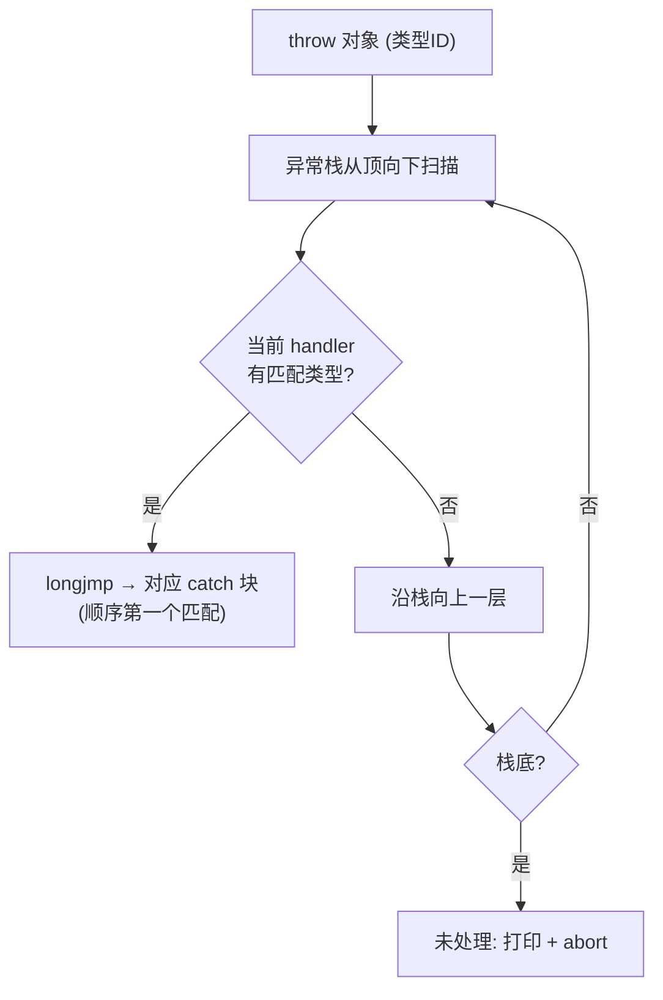

# MYP 异常机制设计（Exceptions）

> 状态：**已实施**（E1–E4 完成 + finally 传播 + `catch (Error e)` 接口匹配）
> 关联：语言规格 v1.0（`docs/grammar.md`）、变更策略（`docs/CHANGELOG.md`）、
> 现有异常实现（`src/runtime/runtime.c` + `src/codegen/codegen.cpp`）
> 本文档完善 MYP 异常机制：**简洁语法 + 对象异常 + 类型体系 + 多 catch 分发 + 传播**。

---

## 1. 背景与现状

### 1.1 现有实现

| 项 | 现状 |
|---|---|
| 语法 | `try { } catch (string e) { } finally { }` |
| 机制 | C `setjmp`/`longjmp` + 线程本地异常处理器栈（每 try 独立 jmp_buf，push/pop） |
| 抛出 | `__myp_throw("msg")`（只接受 string） |
| 测试 | `tests/exception`（单层/嵌套/跨函数/线程）全绿 |

### 1.2 现有限制

1. **catch 只能捕获 `string`**：无类型化异常对象
2. **`__myp_throw` 只接受 string**：无法抛自定义错误对象/结构化信息
3. **单 catch 子句**：无按类型分发，`catch` 总是"最近 handler 全收"
4. **无未处理语义**：异常一路向上到最外层后无定义（越界后 UB）

---

## 2. 目标特性总览

1. **简洁语法**：`catch (e)` 省略类型；表达式式 try（失败给默认值）
2. **对象异常**：`throw expr`（string 快捷或 class 实例）
3. **类型体系**：`interface Error` 统一契约 + 用户异常类
4. **多 catch 分发**：按序类型匹配 + 兜底 + 不匹配 rethrow
5. **传播语义**：内层不匹配 → 向外层传播；全不匹配 → 明确的未处理行为
6. **finally**：异常路径 finally 语义明确化

---

## 3. 语法设计（全部 additive）

```ebnf
TryStmt      ::= 'try' Block CatchClause+ FinallyClause?     // 至少一个 catch
CatchClause  ::= 'catch' '(' (TypeName Identifier | Identifier)? ')' Block
               // 有类型: 按类型匹配; 无类型: 兜底（捕获一切，e 为 string）
FinallyClause::= 'finally' Block
ThrowStmt    ::= 'throw' Expression ';'                      // string 或 class 实例
TryExpr      ::= 'try' Expression 'catch' '(' Identifier ')' Expression
               // 表达式式: 成功→try 值, 失败→catch 值（类型须兼容）
```

**关键语法点**：
- `catch (e)`（无类型）→ 兜底，`e` 为 `string`（消息），捕获一切异常
- `catch (FileError e)` → 精确匹配 `FileError` 实例
- `throw "msg"` → 快捷抛字符串（内部包装）
- `throw new FileError(...)` → 抛类型化对象
- 表达式 try 覆盖"失败给默认值"高频场景
- 保留 `__myp_throw("msg")`（等价 `throw "msg"`，向后兼容）

---

## 4. 类型体系设计

### 4.1 统一契约：`interface Error`

```myp
interface Error {
    action: string message();   // 人类可读描述
}
```

- **所有异常**（内置 + 用户）实现 `Error`
- catch 到异常对象后可通过 `Error` 契约取 `message()`
- MYP 无 class 继承 → 用**接口**做统一契约（与接口多态机制一致）

### 4.2 内置异常

| 异常 | 用途 |
|---|---|
| `StringError`（内置） | 包装 `throw "msg"` / `__myp_throw("msg")` 的字符串消息 |

### 4.3 用户异常

```myp
class FileError {
    interface class Error;
    action:
        string message() { return "file: " + path_; }
    property:
        string path_;
}
```

### 4.4 类型标识（编译期类型 ID）

- 每个异常 class 编译期分配**全局唯一类型 ID**（codegen 常量表）
- 异常对象携带其类型 ID；catch 子句声明类型对应固定 ID
- 分发 = 运行时比较异常对象 ID 与各 catch 类型 ID

---

## 5. 运行时机制

### 5.1 线程本地异常载体（替代单 string）

```c
// 线程本地
void*  myp_current_exception;    // 异常对象指针（arena class 实例）
int    myp_current_exception_type; // 类型 ID（0 = StringError）
char   myp_error_msg[256];       // 保留：字符串快捷消息
```

- 异常对象是 arena class 实例（进程级分配，`myp_free_all` 统一回收）
- `throw "msg"` → 内部构造 `StringError` 并设类型 ID
- `throw obj` → 保存对象 + 其类型 ID

### 5.2 异常处理器栈（扩展现有）

```c
struct handler { void* jmp_buf; int catch_type_ids[N]; int n; bool has_catchall; };
// 每层 try: 记录 jmp_buf + 本层所有 catch 子句的类型 ID + 是否有兜底
```

- `push`：try 入口（setjmp 前）
- `pop`：try/finally 结构结束处
- `throw`：保存异常对象 → 从**栈顶**向下**扫描**第一个能匹配的 handler → longjmp 到该 handler 的 jmp_buf

### 5.3 未处理异常

- 扫描到栈底仍无匹配 → 打印 `Unhandled exception: <message>` → `abort()`
- 明确终止，避免 UB

---

## 6. 分发与传播语义



**规则**：
1. **按序匹配**：多 catch 子句第一个类型匹配的生效
2. **兜底**：`catch (e)`（无类型）匹配一切，放最后兜底
3. **rethrow**：当前 try 所有 catch 都不匹配 → 异常对象保留，沿异常栈向外传播
4. **finally 总是执行**：无论正常/异常/传播路径，finally 块都执行
5. **未处理**：到栈底无匹配 → 打印 + abort

**传播的正确性**：异常对象在线程本地持续存活，rethrow 只是跳到外层 handler 重新分发，对象不丢失。

---

## 7. 简洁语法详细

### 7.1 `catch (e)` 兜底

```myp
try { load(); } catch (e) {           // 捕获一切，e 是 string 消息
    Console.writeString("failed: " + e);
}
```

### 7.2 表达式式 try

```myp
// 单表达式
var n = try parseInt(s) catch (e) 0;

// 块式（块内最后一个表达式为值）
var v = try {
    int x = parseInt(s);
    x * 2;
} catch (e) {
    0;
};
```

- **类型规则**：`try` 表达式类型与 `catch` 表达式类型须兼容（`typesCompatible`）
- 与 slice/算子组合：`var safe = try A + B catch (e) empty;`

---

## 8. 设计取舍（待评审）

| # | 决策点 | 候选 | 建议 |
|---|---|---|---|
| 1 | **类型匹配语义** | 精确 class ID vs 接口兼容 | **精确 ID + 兜底**；接口匹配（`catch (Error e)`）作扩展 |
| 2 | **异常对象生命周期** | arena 进程级 vs region | **进程级**（跨 handler 传播需存活；避免 region 边界问题） |
| 3 | **string 快捷** | 保留 vs 强制对象 | **保留** `throw "msg"`（高频、简洁）|
| 4 | **`catch (e)` 变量类型** | string vs Error 接口 | **string**（消息，最简单）；Error 需接口匹配作扩展 |
| 5 | **表达式 try 范围** | 单表达式 vs 块 | **两者**（单表达式常用 + 块式通用）|
| 6 | **未处理行为** | abort vs 默认捕获 | **abort + 明确消息**（避免静默）|
| 7 | **throw 新关键字** | `throw` 关键字 vs 仅 intrinsic | **`throw` 关键字**（additive，新关键字）|

---

## 9. 实现面评估

| 层 | 改动 |
|---|---|
| **Parser** | 多 catch 子句 + 类型；`throw` 语句；表达式 try；`catch (e)` 省略 |
| **Sema** | 类型体系（`Error` 接口识别）；catch 类型检查；表达式 try 类型兼容；`throw` 类型校验 |
| **Codegen** | 类型 ID 表；异常对象载体；多 catch 分发（顺序匹配 + rethrow 扫描）；表达式 try 结果槽 |
| **Runtime** | `myp_current_exception` + 类型 ID；handler 栈扩展（类型列表）；扫描/分发/rethrow；未处理 abort |
| **Stdlib** | 内置 `StringError` + `interface Error`（`stdlib/error.myp`）|
| **现有 `__myp_throw`** | 保留（= `throw "msg"`） |

**风险**：分发 + rethrow 的扫描正确性（handler 栈 + 类型 ID + longjmp 目标选择）是核心难点；改动集中在异常路径，不碰正常执行路径，符合 v1.0 非破坏约束。

---

## 10. 评审清单（已决 + 实施状态）

| # | 问题 | 决策 | 状态 |
|---|---|---|---|
| 1 | 类型匹配：精确 class ID vs `catch (Error e)` 接口匹配 | 两者都要：精确 ID 为主，接口匹配作扩展 | ✅ `catch (Error e)` 已实现（`__myp_error_vtables[type_id]` 查表 + fat pointer 绑定，`e.message()` 接口分发）|
| 2 | `catch (e)` 变量类型 | string（消息） | ✅ 已实现 |
| 3 | 表达式 try | 单表达式 + 块式都要 | ✅ 单表达式已实现（PHI 合并）|
| 4 | throw 关键字 | 新增 `throw` | ✅ 已实现（保留 `__myp_throw`）|
| 5 | 未处理行为 | abort + 明确消息 | ✅ 已实现 |
| 6 | 异常对象生命周期 | 进程级 arena | ✅ 已实现 |
| 7 | 与 @region 交互 | 异常对象进程级（不随 region 释放）| ✅ 已实现 |
| 8 | finally + 传播 | 传播路径上也执行 finally（flag 标记源）+ finally 后 rethrow | ✅ 已实现（`finally_flag` alloca，正常/匹配/传播三路统一）|

---

## 11. 实施路线（全部完成）

| 阶段 | 内容 | 状态 |
|---|---|---|
| E1 | 简洁语法：`catch (e)` 省类型 + 表达式式 try | ✅ |
| E2 | 运行时：异常对象载体 + 类型 ID + handler 栈扩展 | ✅ |
| E3 | `throw` 语句 + 内置 `StringError` + `interface Error`（stdlib/error.myp）| ✅ |
| E4 | 多 catch 分发 + rethrow + 未处理 abort | ✅ |
| E4.5 | finally 传播（无 catch/不匹配时也执行 finally 再 rethrow）| ✅ |
| E4.6 | `catch (Error e)` 接口匹配（匹配任意实现 `Error` 的类，`e.message()` 接口分发）| ✅ |
| E5 | 测试 `tests/exception/` 扩展（类型分发/传播/未处理/表达式 try）+ grammar.md 增量 | ✅ 15 用例全绿（正常 + ASAN）|

每阶段独立可验证：构建（正常 + ASAN）+ 全套测试 + fuzz + no-crash 回归。
